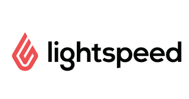
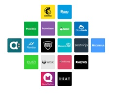

# **Unit-1:Intro to Finance**

## FinTech **Case Study**

*Link* [lightspeed](https://www.lightspeedhq.com/)

# Cloud-based platform as Point of Sale systems

## Lightspeed POS Inc.
  
Lightspeed is a cloud-based commerce platform powering small and medium-sized businesses in over 100 countries around the world. With a smart, scalable, and dependable point of sale systems, it's an all-in-one solution that helps companies sell across channels, manage operations, engage with consumers, accept payments, and grow their business. 

The company was founded by Dax Dasilva to bring the ‘Apple Store Experience’ to retailers through the creation of inventory-centric point of sale systems. Headquartered in Montréal, Canada, Lightspeed is trusted by favorite local businesses, where the community goes to a shop and dine. It has offices in Canada, USA, Europe, and Australia.

Dax DaSilva, Lightspeed’s CEO, founded the company in 2005 and remains the central figure behind its corporate direction, vision, culture, and product development. Dax is supported by a highly experienced management team and expert public company Board of Directors.

Lightspeed is fund by two major partners, Accel Partners and iNovia Capital as follow:
* Accel Partners led a $30 million investment round in 2012; 
* In 2014, Lightspeed closed a $35 million investment round led by iNovia Capital;
* In September 2015, Lightspeed closed a $61 million Series C round of funding led by Caisse de dépôt et placement du Québec and Investissement Québec;
* In October 2017, Lightspeed POS Inc. raised about $160 million in a new round of venture-capital funding. 

On January 30, 2019, Lightspeed Payments rolled out. In March, the company went public on the Toronto Stock Exchange (TSX) under the symbol LSPD.TO. On September 11, 2020, it began trading on the New York Stock Exchange (NYSE) under the symbol LSPD, raising $ 305M.

Dax Dasilva initial idea is to use the raised money to develop new products, as well as, to add new acquisitions. The company CEO believes that Canadian Tech companies are respected and encouraged to be technologies and categories leaders.

The domain of the company is Point of Sale System; They’re the software and hardware that a retail business needs to run their business. From ordering and managing inventory to processing transactions, managing customers, and staff, the point of sale is the central hub that helps retailers grow their business. 

Acting in industries as Retail, Restaurant, and Golf business, to bring Cloud-based solutions for real businesses. Lightspeed helps businesses manage multiple systems together and helping access multiple revenue streams all in one place. Also working remotely, accessing everything from an iPad or mobile phones. And future-proof the business with intuitive, modern tools and regular software updates.  
 

Figure 1 Main Customers
1.	Retail and eCommerce stores
	Lightspeed Retail wasn’t built for side-hustles. Optimize stock, make sales, and learn from your data to grow your business
* Retail point of sale;
* Smart inventory management;
* Powerful reporting;
* Flexible payment options;
* Multi-store capabilities;
* eCommerce integration;
* Explore our Retail POS.

2.	Restaurants and hospitality businesses
	Built for full service, quick service, bars, cafes, and hotel restaurants, Lightspeed Restaurant is equipped to handle the busiest environments.
* Restaurant point of sale;
* Customizable floor plans;
* Multiple menu management;
* Fully featured offline mode;
* Built-in reporting;
* Multi-location management;
* Explore our Restaurant POS.

3.	Golf courses and clubhouses
	Lightspeed Golf is an end-to-end solution that covers your entire operation—from the green to the clubhouse, to the pro shop.
* Golf point of sale;
* Powerful tee sheet;
* Restaurant point of sale;
* Integrated marketing tools;
* Member management;
* Flexible payment options.

Currently, Lightspeed uses technologies like Python, JavaScript, Jupyter, MySQL, CloudFlare, Google Cloud Platform, Amazon EC2, GO, Apollo, Google Analytics, Stack Overflow, GitHub, CircleCI, Slack, Marketo.

Regarding how the company is dealing with the new software, as Gabriel Guzman, Software Development Manager at Lightspeed, comment on Stackshare:
	
“We chose Go because of its readability and focus on writing readable code. The performance also played a part in our decision, as did the ease of deployment. It's also an easy language to learn coming from a PHP background which is what most of our existing developers have. Another benefit is that you'd don't need a separate web server running next to your applications since Go comes with a built-in web server that's production-ready out of the box. This is useful for writing and exposing HTTP APIs. The drawbacks of this decision are that not everyone at LS knows Go and so extra time needs to be spent ramping up on a new language. There are also a few bumps that come with this choice, as the programming paradigm is slightly different when coming from PHP. For example, since Go is a compiled language, sometimes you forget to compile it and wonder why your latest change isn't taking effect. The type system is also a bit of a change coming from the loose typing of PHP. The other challenge is that the Object-Oriented nature of Go is different from PHP (Composition vs Inheritance). None of these drawbacks are deal-breakers however. We decided on GCP because of it's native Kubernetes support. Our site reliability experts have standardized Kubernetes as our containerization standard and at the time we made this decision AWS didn't yet have native Kubernetes support (they do now). In the future, we'll likely move to a cloud-agnostic solution, but for now, we're moving forward on GCP. The drawbacks of this decision are that we're locked into a single cloud provider.”

Throughout any device with internet connectivity — whether it is a laptop, desktop, tablet, or smartphone — and logging into their business portal retailers could start accessing their POS system because of cloud-based server.  The result that it had for retailers was enormous. Being able to run their business, serve customers, and process transactions from anywhere, any device and any time resulted in reduced lineups to pay and faster customer service. The customer experience provided by Apple, only unique to big retailers, is now available for everyone. 80% of retailers that started using a mobile POS grew their sales. Mobile POS systems also opened a ton of new sales opportunities, as opening a pop-up shop or selling at trade shows and festivals.
	
The benefits of a mobile POS system are:
* Mobile checkout and payments.
* Centralized inventory management.
* Real-time access to sales reports.
* Advanced customer data.
* Schedule and manage employees. 
* Integrated payment processing.
* Manage your business anytime, on any device, anywhere.
* Open new stores, fast.
* Customer relationship management capabilities.
 
Regarding the hardware products a business needs, can vary depending on their business type. Below is listed the most common hardware used by the retailer, but keep in mind that not every business need all these products: 
* POS terminal.
* Credit card reader.
* Receipt printer.
* Barcode scanner.
* Cash drawer.

To better understand the practical Lightspeed POS service, the following is an example of how the company is positioned in the market:
 
 

Lightspeed is pride on the fact that their customers have generated an average of more than 20% revenue growth in their first full year on our platform, generating strong loyalty and a positive net dollar retention rate. It will continue to invest in marketing strategies tailored to attract new businesses to the platform. The company also offers options for processing curbside pickups and mobile wallet payments, and integrations with U.S. tech giants like Google and Stripe.	Lightspeed aspires to help growing small business being one-stop shop, offering service as track inventory, schedule home delivers and establish loyalty programs.

One of the major companies in this domain is Square Inc., it is an American financial service, merchant services aggregator, and mobile payment company based in San Francisco, California. The company markets software and hardware payments products and has expanded into small business services.
	
Comparing the companies, Square has a Market Cap 52B, Total Net Revenue was Q2 2020 $1.92B (+64%YOY) and Lightspeed has a Market Cap 3.35B, Total Net Revenue was Q2 2020 CAD36.2M (+51%YOY).
	
The outlook for the second quarter of 2020 Lightspeed financial results are:
* Worldwide Customer Locations Grew to over 77,000
* First Quarter Recurring Software & Payments Revenue Grew 57% YoY
* GTV Improved Throughout the Quarter with 53% Growth in June, Driven by Omnichannel
* First Quarter GTV Related to eCommerce Grew Nearly 100% YoY
* Strong Customer Uptake in Payments, with Record Quarterly Results
* First Quarter Financial Highlights
* Total revenue of $36.2 million, an increase of 51%
* Recurring software and payments revenue of $33.4 million, an increase of 57%
* Gross margin of 60%, with gross profit up by 39% versus the prior-year quarter
* Net loss of ($20.1) million as compared to a net loss of ($9.1) million
* Adjusted EBITDA1 of ($2.2) million, compared to Adjusted EBITDA of ($5.1) million,
* Cash flows used in operating activities of $6.4 million, exclusive of $1.0 million in cash used for acquisition-related costs and stock-based compensation. Including those items, cash used in operations was $7.4 million
* On June 30, 2020, Lightspeed had $203.5 million in unrestricted cash and cash equivalents

As Brandon Nussey, Chief Financial Officer, announced during the company financial results “Lightspeed's customer base showed a quick rebound from April lows induced by the pandemic. On the back of increased digital sales and the recovery of physical sales channels, overall GTV2 growth accelerated throughout the quarter, culminating with 53% growth in June as compared to the prior year. Lightspeed saw strong new customer demand as well, growing its customer locations2 to over 77,000 by the end of June. These factors combined to contribute to a record quarter of volumes processed by Lightspeed Payments, which continued its rapid growth trajectory. We delivered another positive quarter in the face of a challenging macro environment. Most encouraging was the pace of new business as we witnessed accelerated customer adds through the quarter. Our retail customers are growing, and our restaurants are recovering. All told, our customer base has been resilient, especially those businesses leveraging our Omni solutions. Our solid first-quarter execution positions us well to further capitalize on the global market opportunity in front of us."

It would be suggested to the company to work with an Online Store platform that offers Canadian small and medium business owners the tools they need to start or grow their business, similar to Shopify (Ottawa based ecommerce – Amazon rival). Using this platform, the customer doesn’t have to be concerned about the complex backend techy details, Lightspeed would set up and host the ecommerce website and take care of all software upgrades. Lightspeed would create tools to:
* Add new web pages
* Create blog posts
* Manage content through built-in CMS
* Cutting edge mobile commerce features
* Keep track of every order
* Accepting credit card orders

Also Lightspeed could offer ecommerce analytics and integrating with Google Analytics. 

Lightspeed would implement technologies as follow:
* 	Content Delivery Network (CDN) - a CDN is a large network of servers placed across the world to ensure your customers can load your online store as quickly as possible, wherever they are.
* Ruby on Rails - a powerful web framework that lets us make improvements with great speed.
* Weebly - is an AJAX website creator that allows you to create pages with template skins and content widgets. Users can easily drag-and-drop content widgets like pictures, text, video and Google Maps in WYSIWYG-fashion.
* ClickFunnels - is the only website builder that doesn't just build pages, but actually builds entire sales funnels.
* Go Daddy - makes registering Domain Names fast, simple, and affordable.
* PrestaShop - is written in PHP, is highly customizable, supports all the major payment services, is translated in many languages and localized for many countries, and is fully responsive (both front- and back-office).

Sources:

www.Questrade.com

www.lightspeedhq.com

www.squareup.com/ca

www.shopify.ca

https://stackshare.io/feed

